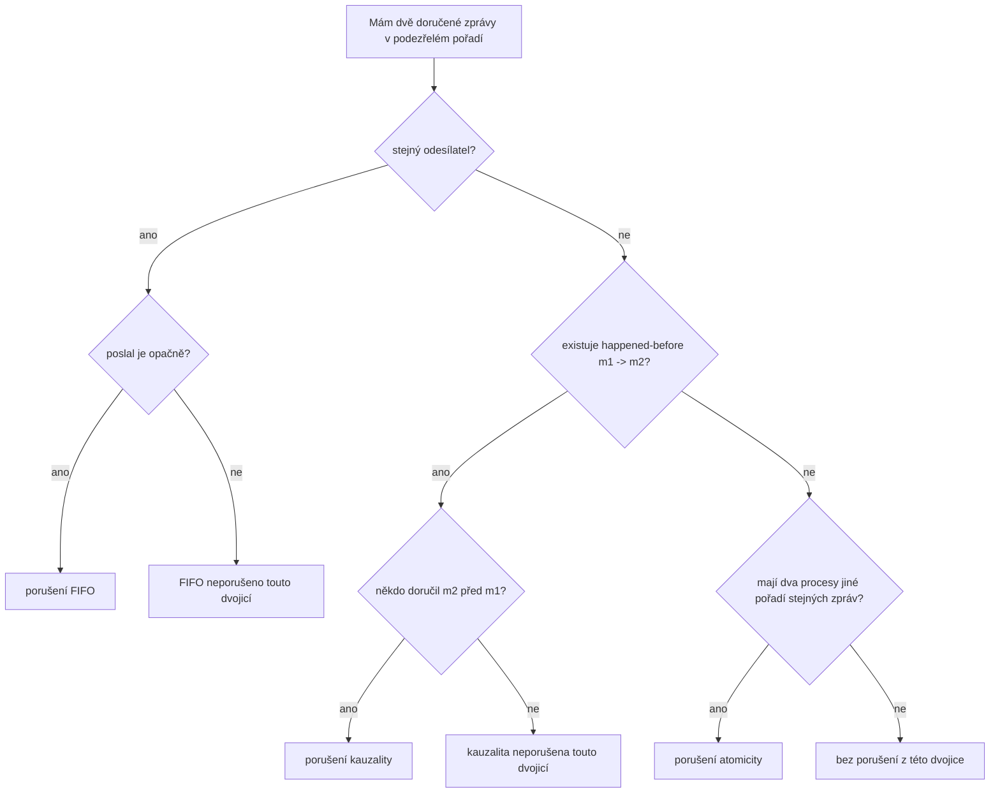

# Broadcast vlastnosti: FIFO, kauzalita, atomicita

Zdrojový topic: [[knowledge/topics/broadcast-fifo-kauzalita]]

## Co si pamatovat

U diagramů nejdřív rozliš, co přesně se kontroluje:

| Vlastnost | Kontroluje | Porušení |
|---|---|---|
| FIFO | pořadí zpráv od stejného odesílatele | někdo doručí `m2` před `m1`, i když stejný odesílatel poslal `m1` před `m2` |
| Kauzalita | happened-before mezi zprávami | někdo doručí následek před příčinou |
| Atomicita | stejné globální pořadí u všech | dva procesy doručí stejné zprávy v jiném pořadí |

## Jedna osa rozhodování

## Mini příklady porušení

### FIFO

Odesílatel `S` pošle `m1`, potom `m2`.

| Proces | Doručení |
|---|---|
| `P1` | `m1`, `m2` |
| `P2` | `m2`, `m1` |

`P2` porušuje FIFO, protože jde o stejný sender `S`.

### Kauzalita

Platí `m1 -> m2`, například `P2` poslal `m2` až po přijetí `m1`.

| Proces | Doručení |
|---|---|
| `P1` | `m1`, `m2` |
| `P3` | `m2`, `m1` |

`P3` porušuje kauzalitu, protože doručil následek před příčinou.

### Atomicita

Zprávy nemusí být kauzálně svázané, ale atomic broadcast vyžaduje jedno globální pořadí.

| Proces | Doručení |
|---|---|
| `P1` | `a`, `b` |
| `P2` | `b`, `a` |

Porušení atomicity: stejné zprávy, jiné pořadí.

## Zkoušková odpověď

1. Vždy napiš, jestli řešíš `deliver`, ne jen `recv`.
2. FIFO dokazuj nebo vyvracej jen u zpráv od stejného odesílatele.
3. Kauzalitu dokazuj přes `->`.
4. Atomicitu dokazuj porovnáním pořadí mezi procesy.

## Časté chyby

- Říct, že atomicita plyne z FIFO. Ne, atomicita je globální pořadí.
- Říct, že kauzalita plyne z pořadí u jednoho sendera. To je jen část kauzality.
- Hledat porušení v nedoručených nebo jen přijatých zprávách.

## Termínové zdroje

- [[knowledge/exams/2019-2020/student-doc-digest]]
- [[knowledge/exams/2020-2021/student-doc-digest]]
- [[knowledge/exams/2023-2024/student-doc-digest]]
