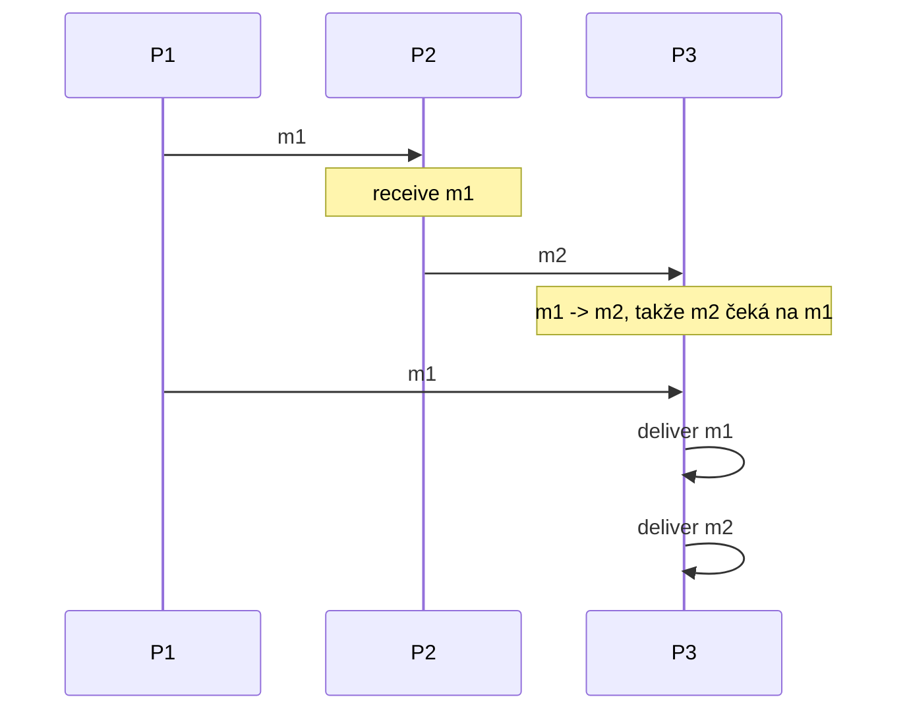
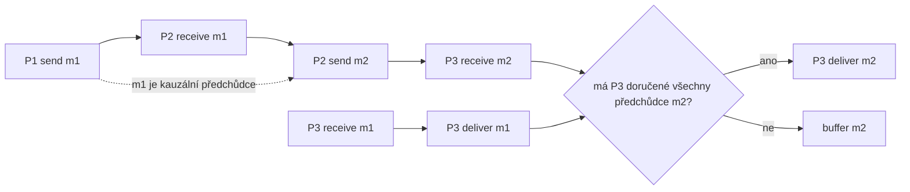

# Kauzalita: happened-before

Zdrojový topic: [[knowledge/topics/broadcast-fifo-kauzalita]]

## Co si pamatovat

- Kauzální broadcast hlídá relaci `->`, ne jen pořadí jednoho odesílatele.
- `m1 -> m2` znamená: každý proces, který doručí obě zprávy, musí doručit `m1` před `m2`.
- Kauzalita vzniká lokálním pořadím událostí, hranami `send -> receive` a tranzitivitou.

## Typický kauzální řetěz

## Proč `m2` čeká

## Happened-before checklist

| Zdroj relace | Co zapsat do diagramu | Typický příklad |
|---|---|---|
| Lokální pořadí | události na jednom procesu jdou shora dolů | `send a -> receive b` na `P2` |
| Komunikační hrana | odeslání zprávy předchází přijetí | `send(m) -> recv(m)` |
| Tranzitivita | spoj předchozí závislosti | `a -> b` a `b -> c`, tedy `a -> c` |

## Zkoušková odpověď

1. Definuj `->` přes lokální pořadí, `send -> receive` a tranzitivitu.
2. U broadcastu řekni, že zpráva nese kauzální historii, typicky vektorové hodiny.
3. Příjemce doručí zprávu až po doručení všech jejích kauzálních předchůdců.
4. Porušení kauzality je doručení následku před příčinou.

## Časté chyby

- Kontrolovat jen přímé hrany a zapomenout tranzitivitu.
- Zaměnit kauzalitu s FIFO; FIFO je jen pořadí jednoho odesílatele.
- Posuzovat `recv` místo `deliver`.

## Termínové zdroje

- [[knowledge/exams/2025-2026/term-0-pretermin-a]]
- [[knowledge/exams/2023-2024/term-0-pretermin]]
- [[knowledge/exams/2022-2023/term-3-druhy-opravny]]
