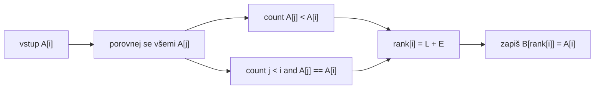
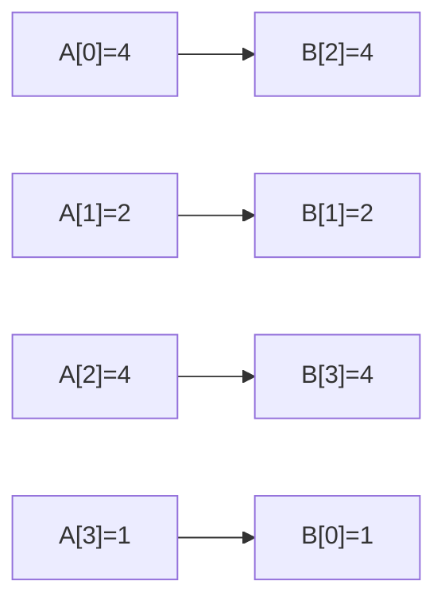

# Enumeration Sort: ranky a duplicity

Zdrojový topic: [[knowledge/topics/razeni-prefix]]

## Princip

Každý prvek dostane výslednou pozici podle toho, kolik prvků je menších. Duplicity se řeší tie-breakem podle původního indexu.

```text
rank[i] = count(A[j] < A[i]) + count(j < i and A[j] == A[i])
B[rank[i]] = A[i]
```

## Datový tok



## Malý příklad s duplicitou

Vstup:

```text
A = [4, 2, 4, 1]
```

### Rank tabulka

Nejdřív spočítej rank každého prvku. Zápis do výstupu nech až na další krok.

| `i` | `A[i]` | menší prvky | duplicity vlevo | `rank[i]` |
|---:|---:|---|---|---:|
| 0 | 4 | `2, 1` | - | 2 |
| 1 | 2 | `1` | - | 1 |
| 2 | 4 | `2, 1` | `A[0] = 4` | 3 |
| 3 | 1 | - | - | 0 |

Kompaktně:

| `i` | Výpočet ranku | Zápis |
|---:|---|---|
| 0 | `2 + 0 = 2` | `B[2] = 4` |
| 1 | `1 + 0 = 1` | `B[1] = 2` |
| 2 | `2 + 1 = 3` | `B[3] = 4` |
| 3 | `0 + 0 = 0` | `B[0] = 1` |

Výsledek:

```text
B = [1, 2, 4, 4]
```

## Pairwise matice

Když zadání chce ukázat “co počítají procesory”, pomůže matice porovnání. Řádek `i` odpovídá prvku `A[i]`; každá jednička přispívá do ranku.

Pravidlo pro buňku `(i, j)`:

```text
1, pokud A[j] < A[i]
1, pokud A[j] == A[i] a j < i
0 jinak
```

| `i \ j` | `A[0]=4` | `A[1]=2` | `A[2]=4` | `A[3]=1` | `rank[i]` |
|---:|---:|---:|---:|---:|---:|
| `i=0`, `A[i]=4` | 0 | 1 | 0 | 1 | 2 |
| `i=1`, `A[i]=2` | 0 | 0 | 0 | 1 | 1 |
| `i=2`, `A[i]=4` | 1 | 1 | 0 | 1 | 3 |
| `i=3`, `A[i]=1` | 0 | 0 | 0 | 0 | 0 |

Výstupní pozice jsou tedy:

```text
rank = [2, 1, 3, 0]
B[2] = A[0] = 4
B[1] = A[1] = 2
B[3] = A[2] = 4
B[0] = A[3] = 1
```



## Registry `X, Y, C, Z`

U zkouškových obrázků se často objevuje topologie procesorů s registry. Typický význam:

| Registr | Smysl |
|---|---|
| `X` | hodnota aktuálního prvku nebo lokální uchovaná hodnota |
| `Y` | porovnávaná hodnota přicházející po lince |
| `C` | čítač/rank nebo průběžný počet menších prvků |
| `Z` | výstupní hodnota nebo pomocný stav |

Přesný význam vždy ověř proti zadání obrázku.

## Zkoušková odpověď

1. Vysvětli rank.
2. Uveď tie-break pro duplicity.
3. Vyplň tabulku `i, A[i], count(<), count(== vlevo), rank`.
4. Teprve potom zapisuj výstup.

## Časté chyby

- Dvě stejné hodnoty dostanou stejný rank.
- Počítá se `<=` místo `< + tie-break`.
- Výstup se indexuje od `1`, i když zadání používá pole od `0`.
