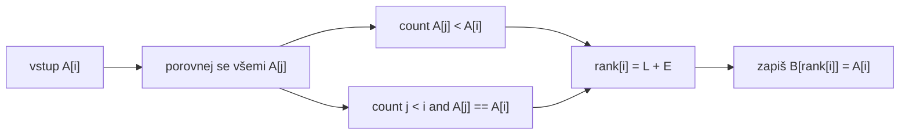

# Enumeration Sort: ranky a duplicity

Zdrojový topic: [[knowledge/topics/razeni-prefix]]

## Princip

Každý prvek dostane výslednou pozici podle toho, kolik prvků je menších. Duplicity se řeší tie-breakem podle původního indexu.

```text
rank[i] = count(A[j] < A[i]) + count(j < i and A[j] == A[i])
B[rank[i]] = A[i]
```

## Datový tok



## Malý příklad s duplicitou

Vstup:

```text
A = [4, 2, 4, 1]
```

| `i` | `A[i]` | `count(< A[i])` | `count(== A[i] vlevo)` | `rank[i]` | zápis |
|---:|---:|---:|---:|---:|---|
| 0 | 4 | 2 | 0 | 2 | `B[2] = 4` |
| 1 | 2 | 1 | 0 | 1 | `B[1] = 2` |
| 2 | 4 | 2 | 1 | 3 | `B[3] = 4` |
| 3 | 1 | 0 | 0 | 0 | `B[0] = 1` |

Výsledek:

```text
B = [1, 2, 4, 4]
```

## Registry `X, Y, C, Z`

U zkouškových obrázků se často objevuje topologie procesorů s registry. Typický význam:

| Registr | Smysl |
|---|---|
| `X` | hodnota aktuálního prvku nebo lokální uchovaná hodnota |
| `Y` | porovnávaná hodnota přicházející po lince |
| `C` | čítač/rank nebo průběžný počet menších prvků |
| `Z` | výstupní hodnota nebo pomocný stav |

Přesný význam vždy ověř proti zadání obrázku.

## Zkoušková odpověď

1. Vysvětli rank.
2. Uveď tie-break pro duplicity.
3. Vyplň tabulku `i, A[i], count(<), count(== vlevo), rank`.
4. Teprve potom zapisuj výstup.

## Časté chyby

- Dvě stejné hodnoty dostanou stejný rank.
- Počítá se `<=` místo `< + tie-break`.
- Výstup se indexuje od `1`, i když zadání používá pole od `0`.
