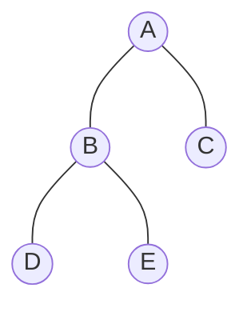

# Euler tour: level a preorder přes scan

Zdrojový topic: [[knowledge/topics/euler-tour-suffix-sums]]

Navazuje na [[knowledge/visuals/euler-tour-etour|Euler tour: orientované hrany a Etour]].

## Vstupní Etour

Použijeme stejný strom:



Etour:

```text
A->B, B->D, D->B, B->E, E->B, B->A, A->C, C->A
```

## Výpočet level(v)

Pro hloubku vrcholu nastav váhy:

```text
dopředná hrana = +1
zpětná hrana   = -1
```

Pak prefix sum po hranách ukazuje hloubku po průchodu danou hranou.

| Pozice | Hrana | Typ | Váha | Prefix | Čtení levelu |
|---:|---|---|---:|---:|---|
| 0 | start v `A` | - | - | `0` | `level(A)=0` |
| 1 | `A->B` | dopředná | `+1` | `1` | `level(B)=1` |
| 2 | `B->D` | dopředná | `+1` | `2` | `level(D)=2` |
| 3 | `D->B` | zpětná | `-1` | `1` | - |
| 4 | `B->E` | dopředná | `+1` | `2` | `level(E)=2` |
| 5 | `E->B` | zpětná | `-1` | `1` | - |
| 6 | `B->A` | zpětná | `-1` | `0` | - |
| 7 | `A->C` | dopředná | `+1` | `1` | `level(C)=1` |
| 8 | `C->A` | zpětná | `-1` | `0` | - |

Výsledek:

| Vrchol | Level |
|---|---:|
| `A` | 0 |
| `B` | 1 |
| `C` | 1 |
| `D` | 2 |
| `E` | 2 |

## Výpočet preorder(v)

Preorder pořadí získáš tak, že započítáš první vstupy do vrcholů.

Jednoduchá váha:

```text
dopředná hrana = 1
zpětná hrana   = 0
```

Kořen dostane preorder `1`. Každá dopředná hrana poprvé vstupuje do potomka.

| Pozice | Hrana | Typ | Váha | Prefix | Čtení preorderu |
|---:|---|---|---:|---:|---|
| 0 | start v `A` | - | - | `1` | `preorder(A)=1` |
| 1 | `A->B` | dopředná | `1` | `2` | `preorder(B)=2` |
| 2 | `B->D` | dopředná | `1` | `3` | `preorder(D)=3` |
| 3 | `D->B` | zpětná | `0` | `3` | - |
| 4 | `B->E` | dopředná | `1` | `4` | `preorder(E)=4` |
| 5 | `E->B` | zpětná | `0` | `4` | - |
| 6 | `B->A` | zpětná | `0` | `4` | - |
| 7 | `A->C` | dopředná | `1` | `5` | `preorder(C)=5` |
| 8 | `C->A` | zpětná | `0` | `5` | - |

Výsledek pro toto pořadí dětí:

```text
A, B, D, E, C
```

## Prefix vs suffix

Ve zkoušce může být daná funkce `SuffixS`. Princip je stejný:

- nastavíš váhy nad orientovanými hranami;
- scan/suffix sum spočítá kumulované hodnoty;
- musíš jasně říct, **u které hrany čteš hodnotu pro vrchol**;
- podle konvence může být potřeba konstantní korekce nebo opačné znaménko.

Bezpečná formulace:

> Pro `level(v)` čtu hodnotu u první dopředné hrany vstupující do `v`; kořen nastavím zvlášť na `0`. Pokud zadání používá suffix sum v opačném směru, použiji stejnou váhovou logiku, jen hodnotu čtu podle směru daného `SuffixS`.

## Zkoušková odpověď

1. Vypiš Etour jako orientované hrany.
2. Označ dopředné a zpětné hrany.
3. Pro `level`: váhy `+1/-1`.
4. Pro `preorder`: váhy `1/0` na první vstupy.
5. Udělej prefix/suffix tabulku.
6. Uveď, ze které hrany bereš hodnotu vrcholu.
7. Paralelní scan má hloubku `O(log n)` a práci `O(n)`.

## Časté chyby

- Číst level na zpětné hraně místo na první dopředné hraně do vrcholu.
- Zapomenout kořen jako speciální případ.
- Počítat preorder i na zpětných hranách.
- Neuvést, jestli indexuješ preorder od `0` nebo od `1`.
