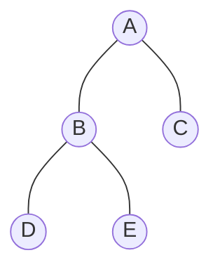
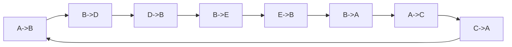

# Euler tour: orientované hrany a Etour

Zdrojový topic: [[knowledge/topics/euler-tour-suffix-sums]]

## Co si pamatovat

- Každou neorientovanou hranu stromu nahradíš dvěma orientovanými hranami.
- Euler tour je cyklus přes orientované hrany.
- Pro hranu `e = (u, v)` je její následník určen lokálním pořadím hran kolem vrcholu `v`.
- Nad pořadím hran v Etour pak počítáš prefix/suffix sum.

## Malý strom



Kořen je `A`. Hrany stromu:

```text
A-B, A-C, B-D, B-E
```

Orientované hrany:

| Hrana stromu | Orientované hrany |
|---|---|
| `A-B` | `A->B`, `B->A` |
| `A-C` | `A->C`, `C->A` |
| `B-D` | `B->D`, `D->B` |
| `B-E` | `B->E`, `E->B` |

Počet orientovaných hran je vždy:

```text
2(n - 1)
```

pro strom s `n` vrcholy.

## Jedno možné pořadí Etour

Při pořadí potomků `B, C` u `A` a `D, E` u `B` může Euler tour vypadat:

```text
A->B, B->D, D->B, B->E, E->B, B->A, A->C, C->A
```



## Dopředné a zpětné hrany

V kořeněném stromu:

- dopředná hrana jde z rodiče do potomka;
- zpětná hrana jde z potomka do rodiče.

| Etour pozice | Hrana | Typ |
|---:|---|---|
| 1 | `A->B` | dopředná |
| 2 | `B->D` | dopředná |
| 3 | `D->B` | zpětná |
| 4 | `B->E` | dopředná |
| 5 | `E->B` | zpětná |
| 6 | `B->A` | zpětná |
| 7 | `A->C` | dopředná |
| 8 | `C->A` | zpětná |

## Zkoušková odpověď

1. Nakresli strom a označ kořen.
2. Každou hranu nahraď dvěma orientovanými hranami.
3. Vypiš jednu konzistentní Etour posloupnost.
4. Označ dopředné a zpětné hrany.
5. Teprve potom nastav váhy pro `level`, `preorder` nebo počet potomků.

## Časté chyby

- Vypsat jen vrcholy místo orientovaných hran.
- Zapomenout zpětné hrany.
- Míchat pořadí dětí a tím vytvořit nekonzistentní Etour.
- Neříct, která hrana je dopředná a která zpětná.
