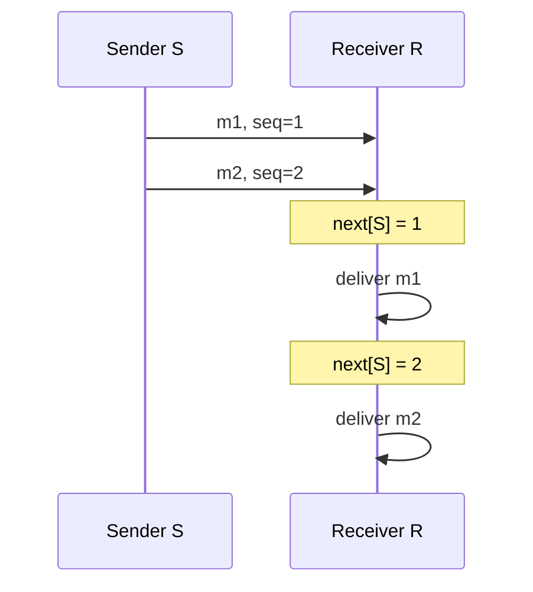

# FIFO broadcast: sekvence a buffer

Zdrojový topic: [[knowledge/topics/broadcast-fifo-kauzalita]]

## Co si pamatovat

- FIFO se kontroluje **zvlášť pro každého odesílatele**.
- Odesílatel přidá ke zprávě sekvenční číslo.
- Příjemce doručí jen očekávané číslo `next[sender]`.
- Pozdější zpráva může přijít dřív, ale musí zůstat v bufferu.

## Mechanika algoritmu



## Když zprávy dorazí mimo pořadí

```mermaid
flowchart LR
  A["recv m2, seq=2"] --> B{"seq == next[S]?"}
  B -->|ne, next[S]=1| C["buffer m2"]
  C --> D["recv m1, seq=1"]
  D --> E["deliver m1"]
  E --> F["next[S]=2"]
  F --> G["deliver buffered m2"]
```

| Krok | Událost u příjemce `R` | `next[S]` | Buffer | Doručeno aplikaci |
|---|---|---:|---|---|
| 1 | přijde `m2(seq=2)` | `1` | `m2` | nic |
| 2 | přijde `m1(seq=1)` | `1` | `m2` | `m1` |
| 3 | kontrola bufferu | `2` | prázdný | `m2` |

## Šablona send a recv

```text
send(m):
  seq[self]++
  broadcast(self, seq[self], m)

recv(sender, s, m):
  if s == next[sender]:
    deliver(m)
    next[sender]++
    while buffer obsahuje (sender, next[sender]):
      deliver(bufferovaná zpráva)
      next[sender]++
  else:
    bufferuj(sender, s, m)
```

## Zkoušková odpověď

1. Uveď, že FIFO je pořadí zpráv od stejného odesílatele.
2. Popiš `seq` na odesílateli a `next[sender]` na příjemci.
3. Vysvětli buffer: dorazila-li zpráva s větším `seq`, čeká na chybějící předchůdce.
4. Zdůrazni, že přijetí do bufferu není doručení aplikaci.

## Časté chyby

- Posuzovat FIFO mezi různými odesílateli.
- Doručit `seq=2`, i když ještě nebylo doručeno `seq=1`.
- Zaměnit síťové přijetí zprávy s `deliver`.

## Termínové zdroje

- [[knowledge/exams/2023-2024/term-2-prvni-opravny]]
- [[knowledge/exams/2022-2023/term-0-pretermin]]
- [[knowledge/exams/2025-2026/term-0-pretermin-b]]
