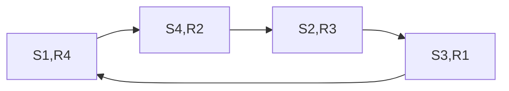
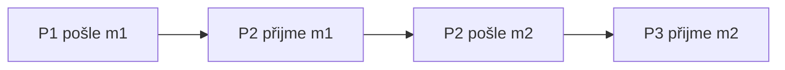

# Koruna a synchronizovatelnost

Zdrojový topic: [[knowledge/topics/broadcast-fifo-kauzalita]]

## Co si pamatovat

- Koruna je cyklický pattern závislostí, který brání synchronnímu rozřezání asynchronního běhu.
- U zkoušky jde typicky o otázku, jestli lze asynchronní komunikaci převést na synchronní kola.
- Pokud najdeš korunu, průběh obecně není synchronizovatelný bez změny pořadí nebo odstranění zpráv.

## Typická koruna

Čtení diagramu: lokální pořadí a zprávové závislosti vytvoří cyklus. Závislost se po několika procesech vrací zpět na začátek, takže nejde vybrat první synchronní kolo bez porušení některé závislosti.

## Kontrast: jen řetěz není koruna

Řetěz závislostí může být synchronizovatelný. Problém je cyklus.

## Postup u diagramu

| Krok | Co udělat | Co hledáš |
|---|---|---|
| 1 | vypiš události po procesech | lokální pořadí |
| 2 | doplň hrany `send -> receive` | komunikační závislosti |
| 3 | spoj závislosti mezi zprávami | kandidáty na cyklus |
| 4 | ověř návrat na začátek | korunu |
| 5 | napiš závěr | synchronizovatelné nebo ne |

## Zkoušková odpověď

1. Definuj korunu jako cyklickou závislost v komunikaci.
2. Ukaž konkrétní cyklus, ideálně posloupností dvojic jako `(S1,R4) -> (S4,R2) -> ...`.
3. Závěr formuluj přímo: koruna existuje, tedy nelze synchronizovat; nebo koruna nevzniká, tedy lze rozdělit do kol.
4. Pokud zadání chce opravu, změň pořadí nebo odstraň hranu tak, aby cyklus zmizel.

## Časté chyby

- Zaměnit libovolný řetěz závislostí za korunu.
- Nenapsat konkrétní cyklus, jen obecně tvrdit, že tam koruna je.
- Řešit jen FIFO nebo kauzalitu, i když otázka míří na synchronizovatelnost.

## Termínové zdroje

- [[knowledge/exams/2024-2025/term-0-pretermin]]
- [[knowledge/exams/2021-2022/student-doc-digest]]
- [[knowledge/sources/student-doc/2021-2022-extract]]
