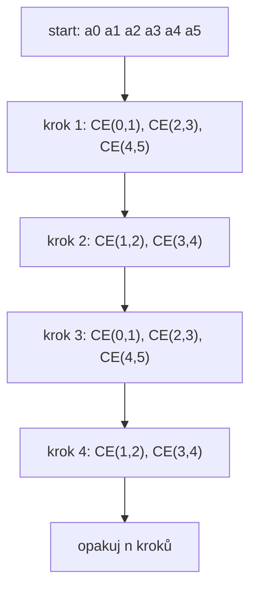
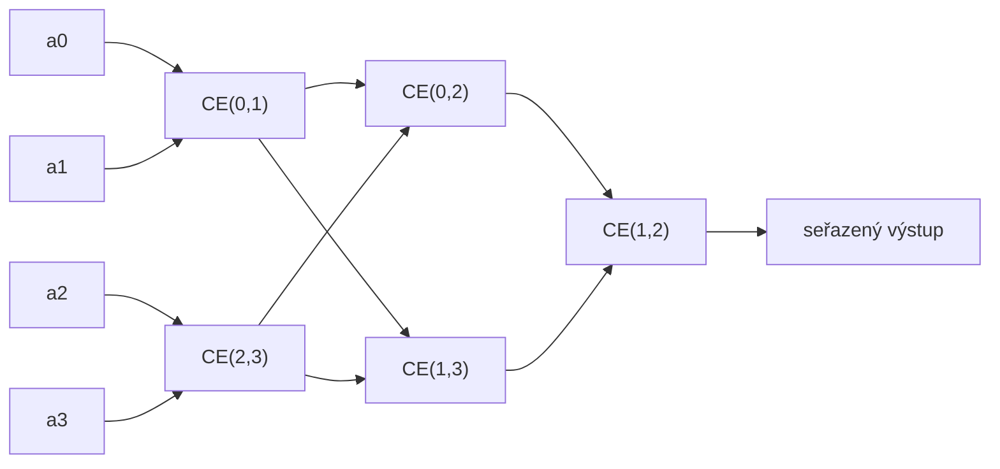

# Odd-even: compare-exchange síť

Zdrojový topic: [[knowledge/topics/razeni-prefix]]

## Odd-even transposition sort

Střídají se sudé a liché vrstvy sousedních compare-exchange operací.



Tabulkově:

| Krok | Aktivní compare-exchange bloky |
|---:|---|
| 1 | `(0,1)`, `(2,3)`, `(4,5)` |
| 2 | `(1,2)`, `(3,4)` |
| 3 | `(0,1)`, `(2,3)`, `(4,5)` |
| 4 | `(1,2)`, `(3,4)` |

## Odd-even merge sort pro 4 vstupy

Pro malou síť je nejpraktičtější kreslit vrstvy CE bloků.



Stejná síť jako vrstvy:

| Vrstva | CE bloky |
|---:|---|
| 1 | `(0,1)`, `(2,3)` |
| 2 | `(0,2)`, `(1,3)` |
| 3 | `(1,2)` |

## Mini příklad transposition sortu

Vstup:

```text
[4, 1, 3, 2]
```

| Krok | Operace | Stav |
|---:|---|---|
| 0 | start | `[4, 1, 3, 2]` |
| 1 | `(0,1)`, `(2,3)` | `[1, 4, 2, 3]` |
| 2 | `(1,2)` | `[1, 2, 4, 3]` |
| 3 | `(0,1)`, `(2,3)` | `[1, 2, 3, 4]` |
| 4 | `(1,2)` | `[1, 2, 3, 4]` |

## Zkoušková odpověď

1. Uveď, které CE bloky běží paralelně v jedné vrstvě.
2. Nezaměň transposition sort a odd-even merge sort.
3. U sítě kresli vrstvy; u simulace kresli stavy po krocích.

## Časté chyby

- Spustit v jedné vrstvě CE bloky, které sdílejí stejný vodič.
- Prohlásit, že transposition sort končí vždy po dvou krocích.
- U merge sítě zapomenout poslední porovnání středních vodičů.
