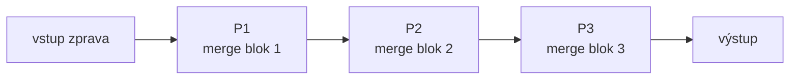
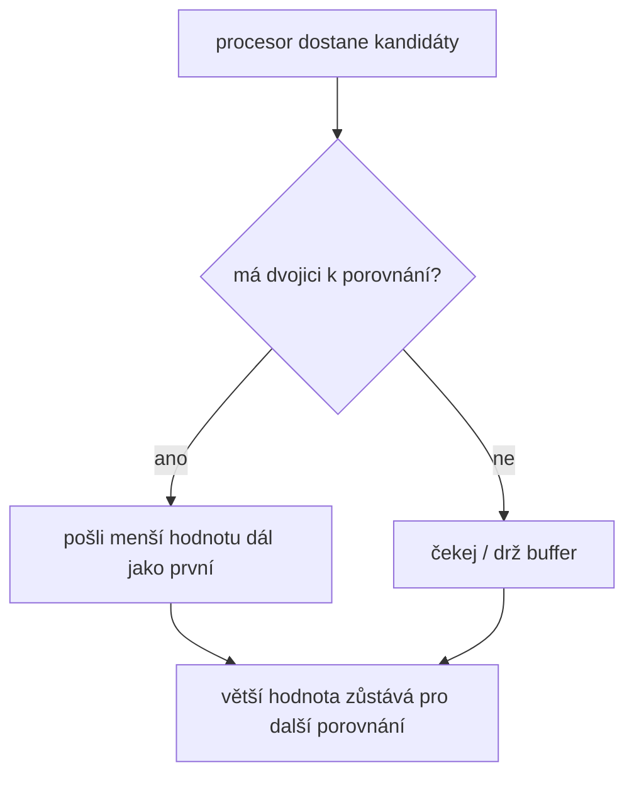

# Pipeline Merge Sort: procesory a tabulka taktů

Zdrojový topic: [[knowledge/topics/razeni-prefix]]

## Proč vizualizovat

U Pipeline Merge Sortu je největší riziko, že člověk přeskočí rovnou na seřazený výstup. Zkouška ale chce stav po konkrétním kroku, takže je potřeba kreslit pipeline po taktech.

## Schéma pipeline



## Zkouškový příklad

Zdroj: [[knowledge/exams/2025-2026/term-0-pretermin-a]]

Vstupní posloupnost:

```text
5, 2, 9, 4, 3, 6, 8, 7
```

Zadání říká, že posloupnost je zpracovávaná zprava, takže první jde do pipeline hodnota `7`.

Pořadí vstupu do pipeline:

```text
7, 8, 6, 3, 4, 9, 2, 5
```

## Worksheet pro simulaci

Vyplňuj po jednom taktu. Do každé buňky zapisuj stav na vstupu/výstupu procesoru nebo lokální buffer podle zadání.

| Krok | nová hodnota | P1 | P2 | P3 | výstup / poznámka |
|---:|---:|---|---|---|---|
| 1 | 7 |  |  |  |  |
| 2 | 8 |  |  |  |  |
| 3 | 6 |  |  |  |  |
| 4 | 3 |  |  |  |  |
| 5 | 4 |  |  |  |  |
| 6 | 9 |  |  |  |  |
| 7 | 2 |  |  |  |  |
| 8 | 5 |  |  |  |  |
| 9 | - |  |  |  |  |
| 10 | - |  |  |  | hledaný stav |

## Pravidlo kroku



## Zkoušková odpověď

1. Napiš pořadí vstupu do pipeline.
2. Nakresli procesory `P1`, `P2`, `P3`, případně další podle `n`.
3. Vyplň tabulku taktů.
4. Stav po požadovaném kroku opiš z posledního řádku tabulky.

## Časté chyby

- Simulovat celý sort místo konkrétního kroku.
- Posunout v jednom taktu víc hodnot, než dovoluje pipeline.
- Zapomenout, že vstup je v zadání zpracovávaný zprava.
