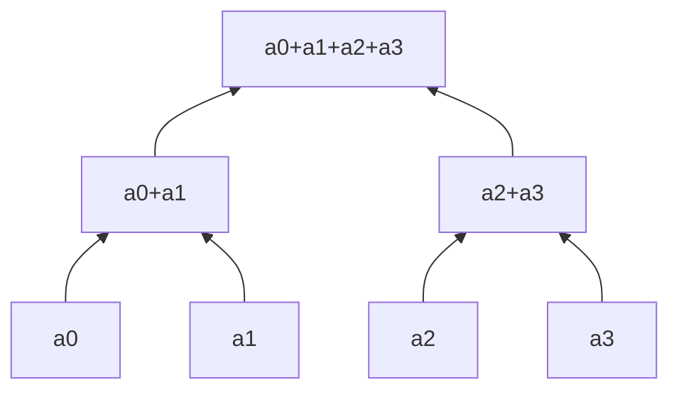

# Prescan: up-sweep a down-sweep

Zdrojový topic: [[knowledge/topics/razeni-prefix]]

## Co si pamatovat

- **Up-sweep** sčítá do redukčního stromu.
- **Down-sweep** nastaví kořen na neutrální prvek a rozdistribuuje prefixy.
- Výsledek níže je **exclusive scan**.

## Strom pro malý příklad



## Konkrétní termínový příklad

Zdroj: [[knowledge/exams/2023-2024/term-1-radny-c]]

Vstup:

```text
3, 15, 2, 8, 12, 10, 3, 2, 12, 11, 17, 5, 19, 2, 5, 1
```

## Up-sweep

| Fáze | Stav pole |
|---|---|
| vstup | `3, 15, 2, 8, 12, 10, 3, 2, 12, 11, 17, 5, 19, 2, 5, 1` |
| po 1. kroku | `3, 18, 2, 10, 12, 22, 3, 5, 12, 23, 17, 22, 19, 21, 5, 6` |
| po 2. kroku | `3, 18, 2, 28, 12, 22, 3, 27, 12, 23, 17, 45, 19, 21, 5, 27` |
| po 3. kroku | `3, 18, 2, 28, 12, 22, 3, 55, 12, 23, 17, 45, 19, 21, 5, 72` |
| po 4. kroku | `3, 18, 2, 28, 12, 22, 3, 55, 12, 23, 17, 45, 19, 21, 5, 127` |

## Down-sweep

Před down-sweep se kořen nastaví na `0`.

| Fáze | Stav pole |
|---|---|
| start | `3, 18, 2, 28, 12, 22, 3, 55, 12, 23, 17, 45, 19, 21, 5, 0` |
| po 1. kroku | `3, 18, 2, 28, 12, 22, 3, 0, 12, 23, 17, 45, 19, 21, 5, 55` |
| po 2. kroku | `3, 18, 2, 0, 12, 22, 3, 28, 12, 23, 17, 55, 19, 21, 5, 100` |
| po 3. kroku | `3, 0, 2, 18, 12, 28, 3, 50, 12, 55, 17, 78, 19, 100, 5, 121` |
| výsledek | `0, 3, 18, 20, 28, 40, 50, 53, 55, 67, 78, 95, 100, 119, 121, 126` |

## Zkoušková odpověď

1. Napiš, zda jde o inclusive nebo exclusive scan.
2. Ukaž alespoň první a poslední krok up-sweep.
3. Ukaž nastavení kořene na `0`.
4. Ukaž alespoň první krok down-sweep a výsledné pole.

## Časté chyby

- Zapomenout nastavit kořen na neutrální prvek.
- Zaměnit inclusive a exclusive výsledek.
- Přepisovat oba prvky dvojice špatným směrem v down-sweep.
